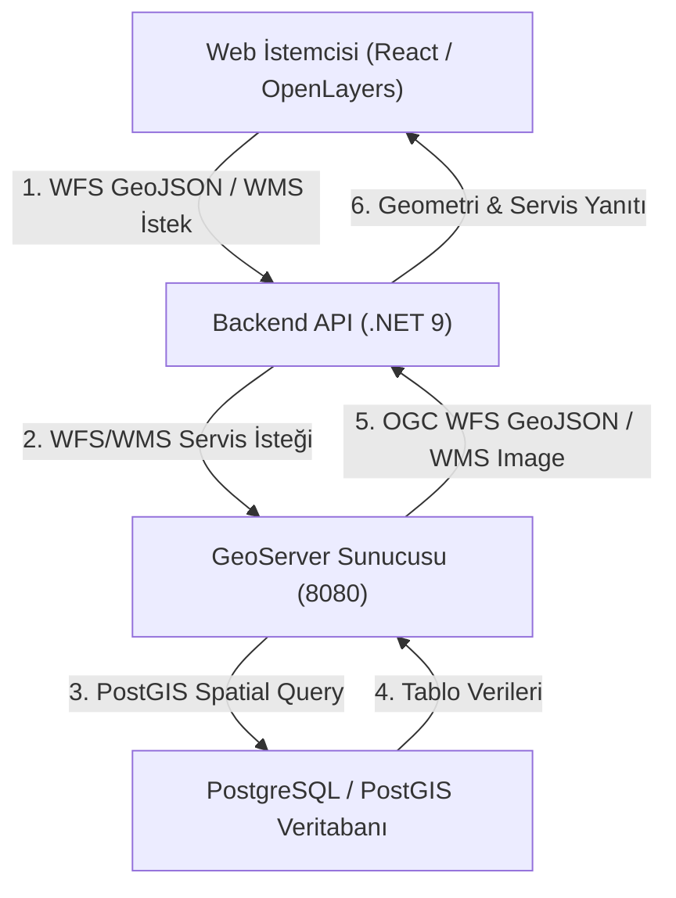

# GeoServer Kurulumu, Kavramlar ve Veritabanı Servis Entegrasyon Rehberi

Bu belge, **GeoraphMap** sistemine entegre edilen **GeoServer (OGC WMS / WFS)** mimarisini, temel CBS kavramlarını, kurulum adımlarını ve PostGIS veritabanı servis katmanı entegrasyonunu açıklamaktadır.

---

## 1. GeoServer Temel Kavramları ve Mimarisi

GeoServer, Açık Coğrafi Konsorsiyumu (OGC - Open Geospatial Consortium) standartlarında coğrafi veri sunan açık kaynaklı bir harita sunucusudur.

### 🔑 Temel Kavramlar:
* **Workspace (Çalışma Alanı):** İlgili coğrafi katmanları, servisleri ve veri kaynaklarını mantıksal olarak gruplayan isim alanıdır (Namespace). Sistemimizde workspace adı: `geomap`.
* **Store (Veri Deposu):** GeoServer'ın fiziki veya mantıksal veriye eriştiği bağlantı kaynağıdır (Örn: PostGIS PostgreSQL veritabanı `geomap_db`, Shapefile veya GeoTIFF).
* **Layer (Katman):** Haritada görselleştirilen veya servisle sunulan vektör/raster coğrafi veri katmanıdır. Sistemimizde eklenen katmanlar:
  - `geomap:tbl_point` (Nokta Katmanı)
  - `geomap:tbl_line` (Çizgi Katmanı)
  - `geomap:tbl_polygon` (Poligon Katmanı)
  - `geomap:tbl_city` (İl Sınırları Katmanı)
* **WMS (Web Map Service):** Coğrafi verileri harita üzerinde gösterilmek üzere georeferanslı **görüntü (PNG/JPEG)** formatında sunan OGC standardıdır.
* **WFS (Web Feature Service):** Coğrafi vektör objelerini ve özniteliklerini ham **coğrafi obje (GeoJSON/GML)** olarak sunan ve vektör manipülasyonuna imkan tanıyan OGC standardıdır.

---

## 2. Local GeoServer Kurulum ve PostGIS Entegrasyon Adımları

1. **GeoServer İndirme & Çalıştırma:**
   - GeoServer resmi web sitesinden (GeoServer Standalone / Platform Independent Binary veya Docker) `http://localhost:8080/geoserver` adresinde çalışacak şekilde başlatılır.
   - Yönetici kullanıcı bilgileri: `admin` / `geoserver`.

2. **Workspace Oluşturma:**
   - Yönetim paneline girin: **Workspaces ➔ Add new workspace**
   - **Name:** `geomap`
   - **Namespace URI:** `http://localhost:8080/geoserver/geomap`

3. **PostGIS Store Bağlantısı:**
   - **Stores ➔ Add new Store ➔ PostGIS**
   - **Workspace:** `geomap`
   - **Data Store Name:** `PostGIS_GeoMap`
   - **Host:** `localhost` | **Port:** `5432` | **Database:** `geomap_db`
   - **User:** `postgres` | **Password:** `1234`

4. **Katmanların (Layer) Yayınlanması:**
   - **Layers ➔ Add new Layer ➔ Select PostGIS_GeoMap**
   - `tbl_point`, `tbl_line`, `tbl_polygon` ve `tbl_city` tablolarının yanında **Publish** butonuna basın.
   - **Declared SRS:** `EPSG:4326`
   - **Bounding Boxes:** *Compute from data* ve *Compute from native bounds* butonlarına basın ve kaydedin.

---

## 3. Backend Servis Mimarisi ve Proxy Akışı

Web istemcisinin veriyi doğrudan veritabanından çekmesi yerine, OGC standartlarına uygun olarak backend üzerinden **GeoServer Proxy / Service** mimarisi kurulmuştur.

---

## 4. Test Edilebilir GeoServer API Endpoint'leri

* **`GET /api/geoserver/wfs/tbl_polygon`**: Poligon katmanını GeoServer WFS servisi üzerinden GeoJSON formatında getirir.
* **`GET /api/geoserver/wfs/tbl_point`**: Nokta katmanını GeoServer WFS servisi üzerinden GeoJSON formatında getirir.
* **`GET /api/geoserver/wfs/tbl_line`**: Çizgi katmanını GeoServer WFS servisi üzerinden GeoJSON formatında getirir.
* **`GET /api/geoserver/wfs/tbl_city`**: İl sınırları katmanını GeoServer WFS servisi üzerinden GeoJSON formatında getirir.
* **`GET /api/geoserver/wms`**: GeoServer WMS harita karolarını proxy üzerinden getirir.
* **`GET /api/geoserver/status`**: GeoServer aktiflik durumunu, workspace ve katman metriklerini döner.
